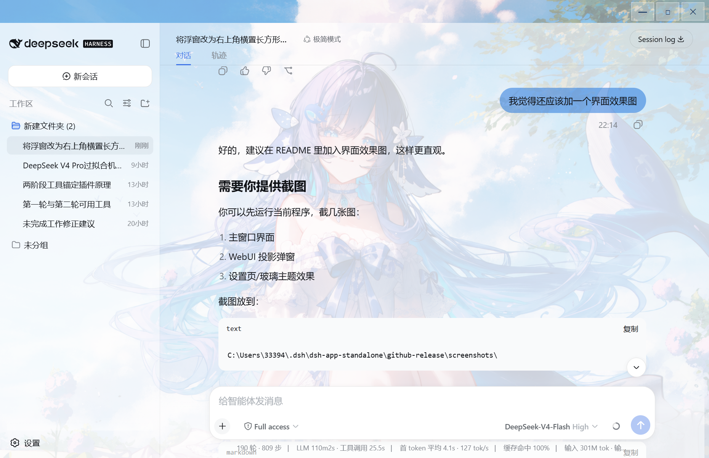
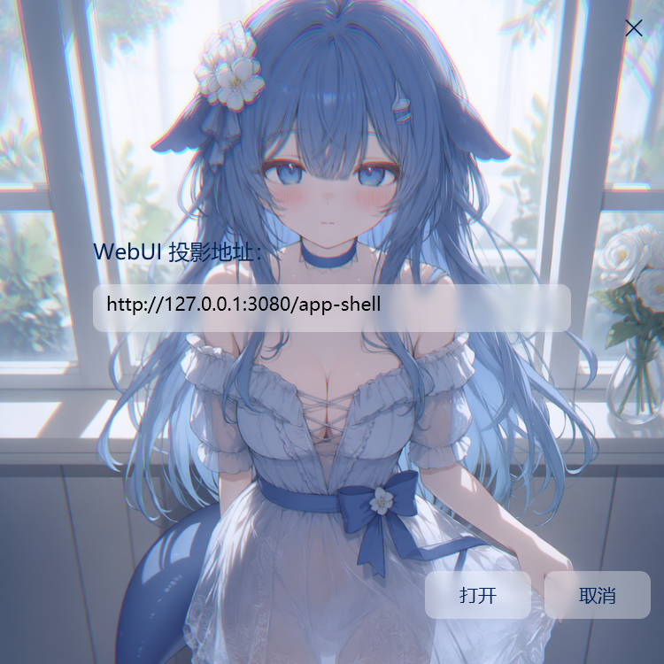

# Desktop DSH Window

基于 WPF + WebView2 的 DSH WebUI 桌面GUI前端。

## 界面预览





## 功能

- 简洁干净的主题和界面
- 无边框窗口，支持拖拽移动和边框缩放
- 右上角玻璃按钮：最小化 / 最大化 / 关闭
- WPF 毛玻璃投影弹窗
- 自动检测 / 启动 DSH 后端
- 找不到 DSH 环境时可自动下载 Node.js + DSH
- 自动向 DSH WebUI 注入玻璃主题样式

## 快速开始

直接运行 `DDSH.exe`。

首次启动时：

1. 检查本机 `3080` 端口是否有 DSH 后端
2. 如果没有，自动查找本机 DSH / Node 环境
3. 找不到时会询问是否自动下载
4. 下载完成后自动打开 WebUI

## 首次启动检测

DDSH 首次启动时会自动检查以下内容：

1. 本机 `3080` 端口是否已有 DSH 后端在运行
2. 本机是否已安装 Node.js
3. 本机是否已安装 DSH / `@deepseek-ai/dsh`
4. 本机是否已安装 WebView2 Runtime

检测结果：

- 如果 DSH 后端已在运行：直接打开 WebUI
- 如果缺少 Node.js 或 DSH：会询问是否自动下载
- 如果缺少 WebView2 Runtime：需要先安装 WebView2 Runtime

## 构建

在项目目录运行：

```powershell
powershell -NoProfile -ExecutionPolicy Bypass -File .\make-package.ps1
```

构建完成后，可执行文件在：

```text
release\DDSH.exe
```

## 主题定制

WebUI 的玻璃主题通过注入 CSS 变量实现。

如果你想调整：

- 背景图
- 侧边栏透明度
- 聊天区透明度
- 用户气泡颜色

可以修改主程序中的 WebUI 注入样式部分，然后重新构建即可。

## 注意事项

- 需要 Windows 10/11 + WebView2 Runtime
- 不打包 DSH 后端，以适配 DSH 破坏性更新
- 如果 DSH 路径变化，删除 `dsh-config.json` 后重新运行
- 杀毒软件误报时请添加信任，或从源码自行构建

## Disclaimer / 免责声明

本项目是 DSH 的第三方桌面 GUI 前端。

本项目与 DeepSeek / DSH 官方无隶属关系。

项目中使用的商标、名称、Logo 及其他资源版权归各自所有者所有。

如您认为任何内容侵犯了您的权利，请联系我，我会尽快删除相关内容。

---

This project is a third-party desktop GUI frontend for DSH.

It is not affiliated with, endorsed by, or sponsored by DeepSeek or DSH.

All trademarks, product names, logos, and other assets belong to their respective owners.

If you believe any content infringes your rights, please contact me and I will remove it promptly.

## License

MIT License

本项目为个人项目，仅供学习与交流使用。
